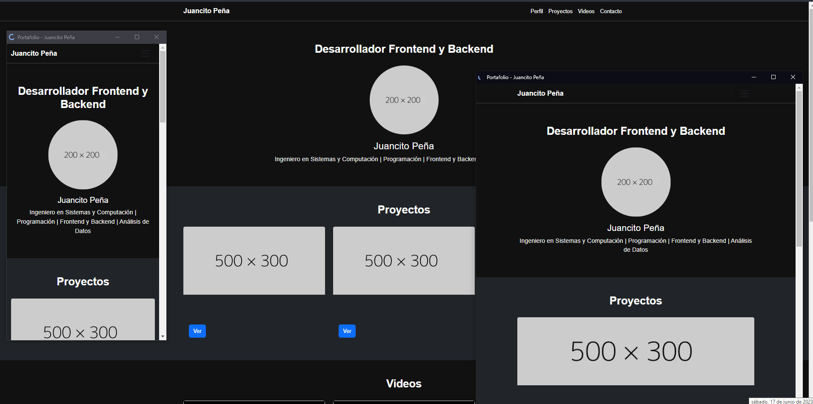

# PORTAFOLIO_HTML_CHATGPP
PORTAFOLIO_HTML_CSS_BOOTSTRAP_CHATGPP

Hola, aqui te dejo el siguiente proyecto, es una Pagina Web basica creada con un Prompt por CHATGPT, el cual tambien te dejo aqui y que te comparto el video tambien:

PROMPT PERSONALIZADO:

# Asume el rol de un Desarrollo Web experto en UI/UX, y Crea un script para una pagina web tipo portafolio en html, bootstrap, con 6 secciones, la seccion # 1-debe tener Menu fijo en la parte superior o navbar-toggler con el pelfil, proyectos, videos, contactos, Seccion # 2 que sea la del peril con un h2 con el titulo Desarrollador Fronted (UI/UX) centrado al centro del en el body, debajo con una fotogragia tambien centrada con una separacion adecuada del menu top y titulo h2 de abrriba, la iamgen tiene que ser circular, con bordes, y una animacion con efecto de latidos de corazon suave y sutil tipo https://dummyimage.com/200x200/ccc/000,  debajo de la imagen el nombre: Juancito Peña, y debajo de este texto otro parrafo con la BIO: Ingeniero en Sistemas y Computación | Programación | Frontend y Backend | Análisis de Datos, 3-Seccion con un encabezado que diga Proyectos, con 3 card juntas en pantalla grande y responsive una, las card deben tener una fotografia del proyecto TIPO dummyimage, descripcion,  y boton que diga ver, 4-Seccion con 3 card  para videos TIPO (<iframe class="embed-responsive-item" src="https://www.youtube.com/embed/VIDEO_ID_1" allowfullscreen></iframe>) con nombre y descripcion que sean de youtube, y 5-Seccion que diga Contactos, en la cual se genere un formulario de contacto basico estilo minimalista, y al final 6- Seccion llamada Footer que tenga  varios iconos y el footer, recordar el menu fijo.y en el footer los iconos de redes sociales, asegurate de llamar en todos los casos las cdn tanto de bootstrap como la de los iconos. EL formato que sea un dark, con blancos y rojos. Nota todos los botones deben estar al centrados. y los demas elementos como imagenes, iconos, textos tambien centrados, Recordar hacerlo para un aprendiz de programacion y comentale el codigo.

VIDEO DEL CANAL: https://www.youtube.com/@JuancitoPenaV

ChatGPT es un modelo de lenguaje desarrollado por OpenAI, basado en la arquitectura GPT-3.5. y que hoy dia cuanta con la version GPT4.0. Este modelo ha demostrado ser extremadamente útil en una amplia variedad de aplicaciones, pero lo que realmente lo ha catapultado a la fama es su habilidad para generar conversaciones de manera fluida y coherente.

Recientemente, Stack Overflow, justo en mayo 2023, la plataforma más grande para programadores, realizó una encuesta a más de 90,000 desarrolladores de todo el mundo. ¡Y adivinen qué! El 83% de los encuestados afirmaron que utilizan ChatGPT y otras herramientas basadas en inteligencia artificial para ayudar en su trabajo diario. ¡Eso es un número impresionante!

Entonces, ¿por qué ChatGPT se ha convertido en la herramienta más utilizada por los desarrolladores? La respuesta radica en su capacidad para generar prompts efectivos. Un buen prompt es crucial para obtener resultados precisos y relevantes. Con ChatGPT, puedes establecer el contexto adecuado, hacer preguntas específicas y obtener respuestas detalladas y personalizadas.

Ahora, ¿qué pasa con la página web que acabamos de crear utilizando ChatGPT? Permíteme mostrarles el resultado. Esta página web tipo portafolio fue diseñada por un experto en desarrollo web, con un enfoque en UI/UX. El diseño es moderno, con un atractivo esquema de colores oscuros y elementos centrados para brindar una experiencia visual impactante.

La página incluye seis secciones cuidadosamente diseñadas: un menú fijo en la parte superior, una sección de perfil con una imagen circular y un efecto de latidos suave y sutil, una sección de proyectos con tarjetas interactivas, una sección de videos de YouTube, una sección de contactos con un formulario minimalista y, por último, un elegante footer con iconos de redes sociales.

Gracias a la flexibilidad y capacidad de generación de ChatGPT, pudimos crear esta página web de manera rápida y eficiente. Desde el diseño hasta la funcionalidad, todo se logró mediante la generación de un prompt efectivo y la aplicación de las mejores prácticas en desarrollo web.

Así que, si eres un desarrollador o simplemente te apasiona la tecnología o eres un aprendiz o estas comenzando a estudiar programacion, no puedes dejar de experimentar con las posibilidades que ofrece ChatGPT y otras herramientas basadas en inteligencia artificial. ¡Estoy emocionado por todo lo que está por venir!

Recuerda, el poder de un buen prompt en ChatGPT está en tus manos. Así que, ¡ponlo a prueba y déjate sorprender por los resultados! Espero que hayan disfrutado de este video. No olviden suscribirse y dejar sus comentarios. ¡Hasta la próxima!

✔  No olvides suscribirte, compartir el video, darle like y dejar tus comentarios en la sección de abajo. ¡Tu apoyo es muy importante para mí  y me ayudas a seguir creando contenido. 💚

1-🎬 Youtube:  https://www.youtube.com/@JuancitoPenaV
2-👨‍💼 LinkedIn: https://www.linkedin.com/in/juancitop...
3-📰 Blog: https://advisertecnology.com/
4-📷 Instagram: https://www.instagram.com/juancito.pe...
5-📑 Facebook:https://www.facebook.com/juancito.p.v
6-🐦 Twitter: https://twitter.com/JuancitoPenaV

## Fotos:

